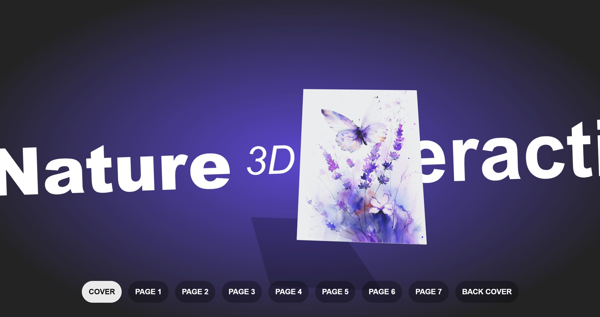

# Virtual Brochure: Immersive Nature Experience ✨

[](https://virtual-brochure.vercel.app/)

Discover a captivating journey through nature with **Virtual Brochure**. This interactive 3D experience brings the beauty of the outdoors to your fingertips. Explore page after page of stunning landscapes, from towering mountains to serene beaches, all within the pages of a virtual book. Brought to life using ReactJS, Three.js, and React Three Fiber, this virtual book offers a unique and engaging experience. Click through the pages to uncover hidden details and immerse yourself in the natural world.

## Key Features:

- **3D Book Experience**: Navigate through a virtual book with lifelike 3D pages.
- **Interactive Pages**: Turn pages effortlessly and discover hidden details in every scene.
- **Immersive Nature Scenes**: Explore stunning high-resolution images of diverse landscapes.
- **Cutting-Edge Technology**: Built with ReactJS, Vite, Three.js, and React Three Fiber.

## Built With

- [ReactJS](https://react.dev/)
- [Vite](https://vitejs.dev/)
- HTML & CSS (Structure and Styling)
- JavaScript (Interactivity)
- [Tailwind CSS](https://tailwindcss.com/) (Utility-First CSS Framework)
- [Three.js](https://threejs.org/) (JavaScript 3D Library)
- [React Three Fiber](https://docs.pmnd.rs/react-three-fiber/getting-started/introduction) (3D Graphics Library)
- [React Three Drei](https://github.com/pmndrs/drei)

## Getting Started

To get a local copy of this project up and running, follow these steps:

### Prerequisites

Make sure you have Node.js installed.

### Installation

Clone the repository and install dependencies.

```bash
git clone https://github.com/DV192/virtual-brochure.git
cd virtual-brochure
npm install
```

### Usage

Start the development server.

```bash
npm run dev
```

Visit http://localhost:5173 in your browser.

## Project Inspiration

This project was created by following the tutorial on [Wawa Sensei YouTube Channel](https://www.youtube.com/@WawaSensei). Special thanks to the creator for the guidance and inspiration.

## Deployment

This project is deployed on [Vercel](https://vercel.com/). Visit the live version [here](https://virtual-brochure.vercel.app/).
